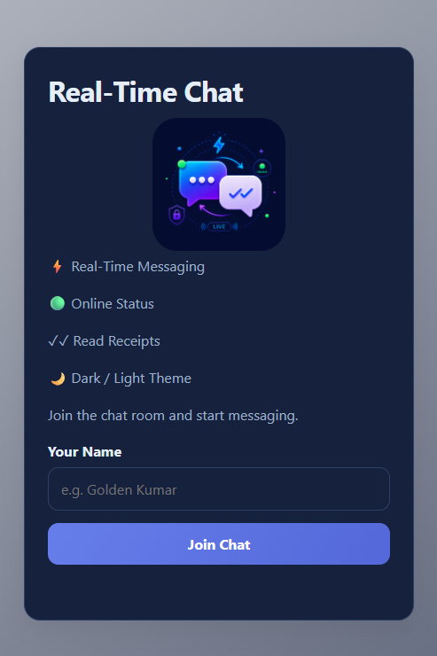
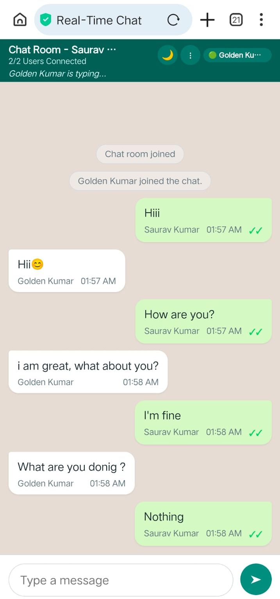
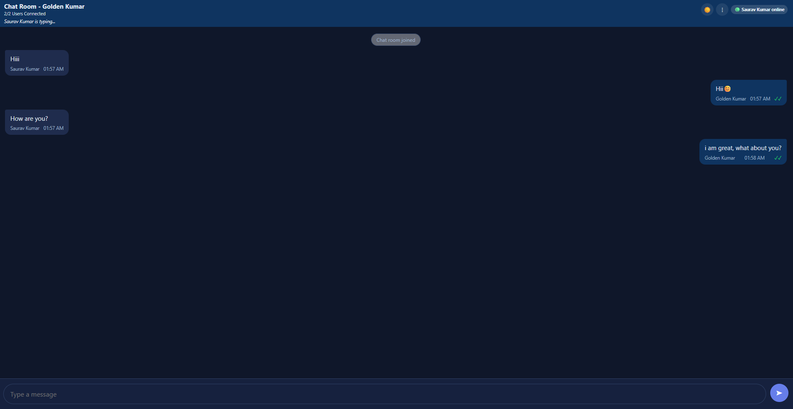
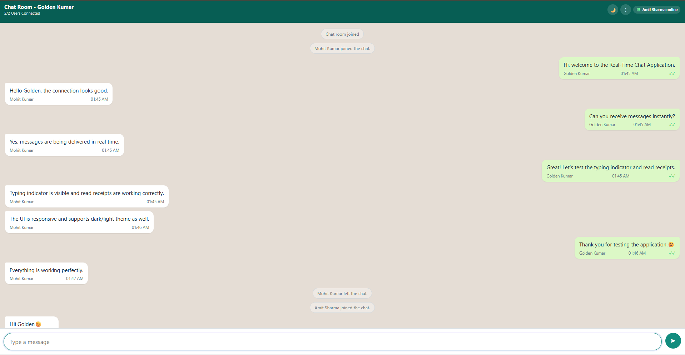

# Real-Time Chat Application

A modern real-time chat application built using **Java WebSocket, HTML, CSS, and JavaScript**. The application enables instant communication between users through persistent WebSocket connections and provides a clean, responsive, and user-friendly interface.

## Live Demo

Frontend: https://realtime-chatgo.netlify.app/

## Features

* Real-Time Messaging
* Online User Status
* Typing Indicator
* Read Receipts (Double Tick)
* Dark / Light Theme Toggle
* Responsive Design (Desktop & Mobile)
* User Input Validation
* Join / Leave Notifications
* Two-User Real-Time Communication
* WebSocket-Based Instant Updates

## Technology Stack

### Frontend

* HTML5
* CSS3
* JavaScript

### Backend

* Java
* WebSocket

## Screenshots

### Login Screen



### Mobile Chat Interface



### Desktop Chat - Dark Theme



### Desktop Chat - Light Theme



## Project Structure

```text
RealTimeChat/
│
├── frontend/
│   ├── index.html
│   ├── style.css
│   ├── script.js
│   ├── theme.js
│   └── Chat-image.png
│
├── screenshots/
│   ├── 01_Login_Screen.png
│   ├── 02_Mobile_Chat_UI.jpeg
│   ├── 03_Desktop_Chat_Dark_Mode.png
│   └── 04_Desktop_Chat_Light_Mode.png
│
├── src/
│   └── Server.java
│
├── Dockerfile
├── Procfile
└── README.md
```

## Getting Started

### 1. Compile the Server

```bash
javac src/Server.java
```

### 2. Run the Server

```bash
java -cp src Server
```

### 3. Launch the Application

Open `frontend/index.html` in your browser.

### 4. Start Chatting

Open the application in another browser window, tab, or device and join with a different username to test real-time communication.

## Key Highlights

* Built using Java WebSocket technology for real-time communication.
* Supports instant message delivery between connected users.
* Displays online user status in real time.
* Includes typing indicators and read receipts.
* Supports dark and light themes.
* Fully responsive on desktop and mobile devices.
* Clean and modern chat interface inspired by popular messaging applications.

## Future Enhancements

* Multi-User Chat Rooms
* User Authentication
* Message History Storage
* Secure WebSocket (WSS) Support
* File & Image Sharing
* Emoji Support
* Push Notifications
* Database Integration (MySQL)

## Author

**Golden Kumar**

GitHub: https://github.com/Goldenkumar97

---

⭐ If you found this project useful, consider giving it a star on GitHub.
